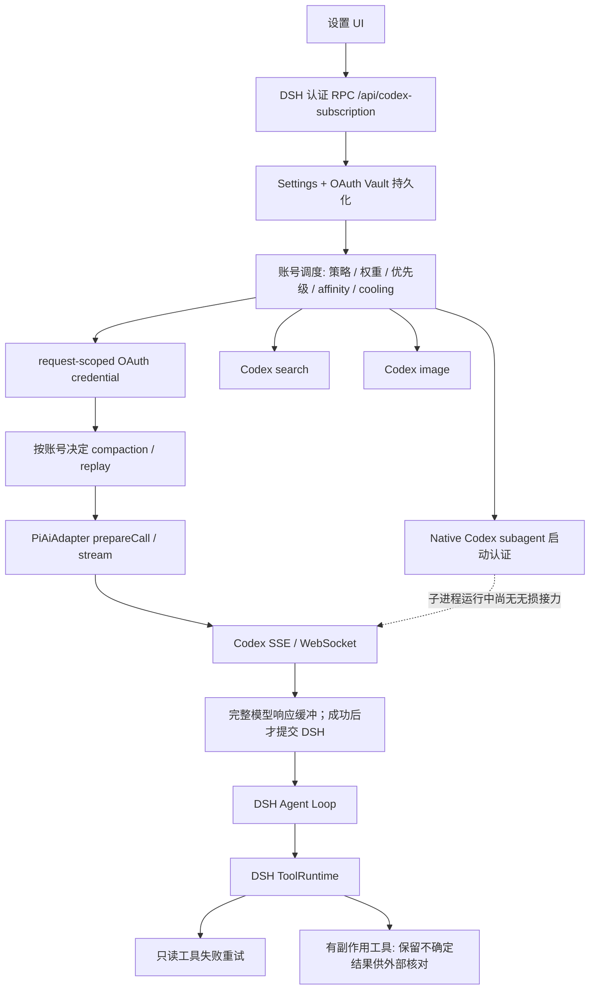

# 尚书省 V4｜Codex 多账号调度与无感接力专项

基线：`e72c4d1d76ac82c63e0b02c3f1fbb1857282fb73`，插件 `2.1.33`。本专项使用假 OAuth 账号、本地 HTTP/SSE 服务器、可控 WebSocket、DSH `ToolRuntime` 和插件真实 `apply` 注册入口；没有消耗真实账号额度。测试与实现位于本仓库，运行状态须另按尚书省正式入口验收。

最后一次完整 `pnpm check`：704 项测试，678 通过、0 失败、26 项按平台条件跳过；服务端/client 构建及 `2.1.34` 发行包打包通过。该数字代表插件仓库测试，不代表正式 DSH 已加载该版。

## 原始 14 项验收索引

| 项目 | 当前证据 | 范围 |
|---|---|---|
| 1 调度设置 | RPC 持久化、重建插件、40 次权重分布、优先级/启停/affinity/fixed 的真实请求 | 模拟产品入口已验；浏览器与正式 Runtime 待验 |
| 2–3 错误和载体 | HTTP 状态矩阵、HTTP 200 SSE `error`/`response.failed`、WS 帧、断流、OAuth 刷新、真实 adapter 请求路径的 DNS/TLS/connect/EOF/timeout 注入 | 这些网络错误由本地假传输产生，不消耗真实账号 |
| 4–6 流边界与提交 | 逐个 SSE 边界故障注入、完整 finish 后提交、只读工具独立恢复 | 上游服务端工具副作用仍须另外证明 |
| 7 请求一致性 | A/B 真请求体 canonical diff：模型、effort、prompt、工具 schema、图片、历史 | WS 私有 cache key 单独隔离 |
| 8 私有续接状态 | A compaction/加密 reasoning 从 B 消失；WS A 用 previous_response，B 用完整历史 | 无上游模型字段时无法证明真实模型 |
| 9 长任务 | 十轮步骤，第 2/5/8 步换号；有效工具完成与副作用各一次 | 模型语义质量在假上游只能做确定性脚本断言 |
| 10 模型完整性 | Astra/Sol 指定模型及 SSE/WS、图片的错模检测与继续尝试 | 上游不报告模型时证据缺失 |
| 11 调用面 | 主对话/prepareCall、搜索、图片、compaction、native subagent 启动认证 | native child 运行中尚未无损接力 |
| 12 并发动态池 | 12 会话、运行中导入/停用、8 个并发 turn 只刷新一次 OAuth token、多账号冷却与过载恢复 | 正式 Runtime 的高并发压测待验 |
| 13 Chaos | 固定种子 100 轮，至少一可用账号时终止数 0 | 故障族仍有限，不能证明无限状态空间 |
| 14 全池失败/诊断 | 耗尽后终局链；正常接力进独立诊断事件 | 任意外部副作用尚无通用自动对账 |

## 真实行为图

设置 RPC、Vault 记录与运行设置重新实例化后，8 次 round-robin 真实请求按 A/B 交替；40 次 weighted 3:1 的请求为 30/10。priority、enable/disable、session affinity、固定账号模式均由实际请求头的 `chatgpt-account-id` 验证，而非仅断言 scheduler 返回值。A/B 实际请求体还做了完整 canonical diff，覆盖指定模型、high 思考强度、system prompt、已完成历史、工具 schema 与图片附件；账号私有 WebSocket `prompt_cache_key` 单独断言隔离。固定账号模式是显式诊断例外：只用指定账号，不跨号接力。

## 故障分类与处置矩阵

| 范围 | 注入形态 | 处置 | 自动化证据 |
|---|---|---|---|
| 请求 | 普通 400/404、context length、content policy、无效参数 | 停止同请求轮询账号，不污染池 | HTTP 请求错误与分类测试 |
| 凭据 | 401/403、invalidated token、OAuth refresh failure | 排除该账号，切下一账号；凭据冷却 | HTTP 矩阵、假 OAuth 刷新 |
| 模型/额度 | 五小时或周 usage limit、账号专属 model unavailable、model mismatch、图片缺失 | 仅隔离当前账号的请求模型，不封锁兄弟模型 | 额度/权限/模型错配/图片完整性测试 |
| 模型限流 | 普通 429 rate limit | 当前账号当前模型冷却，切下一账号 | HTTP 429 与模型作用域测试 |
| Provider | 429 overload、500/502/503/504/520–526、HTTP 200 流内 selected-model capacity | 跨账号尝试；短暂整体过载后再跑有限轮；不逐个污染账号 | HTTP 矩阵、CPA 型流内容量、跨轮恢复 |
| 传输 | 408、DNS、TLS、connect/reset/EOF、idle/premature close | 跨账号尝试并短退避；不把共享故障记成账号额度 | 类型矩阵、本地断流、WebSocket 帧 |
| 只读工具 | 搜索/网页读取/文件读取/严格白名单内的 Shell 查询中途失败，或输出无效 | 在 DSH 提交工具结果前重新完整执行，最多三次；请求错误与取消不重试 | 插件钩子 + 真 `ToolRuntime` 测试 |
| 图片工具 | HTTP 错误、JSON 中途断、空图片、返回错误模型 | 换账号重做直到取得完整 PNG；只有成功结果落一个附件 | 图片入口故障注入与 `saveImage` 次数 |
| 有副作用工具 | 写文件、修改型 Shell、Git、发消息结果不确定 | 不盲目重放；需要先检查文件、仓库或消息服务实际状态 | 真 `ToolRuntime` + 隔离文件/Git/模拟 outbox 测试 |

错误可能来自 HTTP 状态、HTTP 200 中的 `error`/`response.failed`、WebSocket 帧、响应体截断，分类代码处理的是归一化后的请求/凭据/模型/Provider/传输范围。由于 pi-ai 有时只保留错误消息而不保留 HTTP 状态，模型权限识别要求明确的账号语义；普通坏请求不会靠轮遍账号掩盖。

## 缺陷、根因与修复

1. 空 `block-start` 与内部 reasoning 过早提交，HTTP 200 流内失败无法接力。回归测试先在旧实现失败；现在完整模型响应未成功前不向 DSH 提交文本或工具调用。正文中途、工具参数构造中故障也可安全重试，但首字可见时间变晚。
2. 503/传输错误按账号冷却，模型 quota 又按整个账号冷却。改为范围分类：额度/权限按账号+模型，认证按账号，Provider/传输暂态不冷却具体账号。增加有限跨轮恢复。pi-ai 对 429 会把上游的结构化 `resets_in_seconds` 换成友好错误文案；HTTP 错误与 HTTP 200 `response.failed` 现在都把重置时间保留到调度冷却，五小时与周额度各有实际插件入口测试。
3. HTTP 200 的 `Selected model is at capacity` 经 pi-ai 归一化后是普通错误，旧逻辑停止。现识别为 Provider 容量故障并接力。
4. 返回模型与请求模型不同时旧逻辑照常接受。SSE 与 WebSocket 在有效输出前检查上游 `response.model`；图片工具也在保存前检查报告模型。模型字段缺席时不能凭空证明真实模型。
5. 云端 compaction 曾包在调度器外层，A 的加密 checkpoint 可进入 B 请求。现于每次选定账号后再处理 compaction。pi-ai replayState 加账号作用域，换号保留可读历史并剥离上个账号的 response id、签名和加密 reasoning。旧无作用域 replayState 保守降级为完整历史。WebSocket 另有实际帧测试：A 第二次请求使用 `previous_response_id` 优化，换 B 后该字段消失且发送完整历史。
6. 搜索与图片原来直接用 active account，绕过池。现在经统一账号选择和故障分类；搜索响应体中断、图片中断及空 artifact 均能接力。
7. DSH 对工具异常只提交 `isError` 并进入下个模型步骤，没有自动保证重做。新增 `tools/execute` 钩子，限定在 Codex 发起的只读工具与保守 Shell 查询，完整成功前最多重试三次。写/Git/消息不进入该路径。
8. 一次 `response.failed` 被额外记成“stream incomplete”，使诊断链重复。已用结束状态区分流内失败与真正无 finish 截断。
9. Native Codex subagent 在启动认证阶段原来只读 active account。现在启动前经同一 scheduler 选账号，A 认证失败可在启动 child 前转 B，且 refresh 继续锁定 B；child 已运行后的任务接力仍待外部状态协议。

## 长任务与副作用验收

十轮多工具任务在第 2、5、8 步（20%、50%、80%）强制账号接力：完成的工具调用各形成一次有效结果，后续请求保留之前的工具结果与同一会话；失败尝试的工具调用在完整返回前不交给 DSH。SSE 故障边界逐项覆盖 `response.created`、`in_progress`、空 item、reasoning 开始、首 token、正文中途、工具参数构造中、完整工具调用但 finish 前；每项只提交 B 的完整输出，finish 之后追加异常帧不会触发重做。另以 `ToolRuntime` 注入搜索、网页读取、文件读取、只读 Shell 的部分结果后异常，确认只提交第二次完整结果。图片中断/空数据从 B 重做，并且 `saveImage` 只调用一次。独立临时文件、Git 仓库和模拟消息 outbox 的确认回执丢失案例，证明插件不自动重放这些副作用；测试随后检查外部状态，复用已提交结果。

固定种子的 100 轮 Chaos 使用 2–5 个假账号、三种调度策略、随机优先级/权重/affinity 和 HTTP/SSE/断流/模型错配故障；每轮至少一账号可成功处理，100 轮均得到一次完成且同一逻辑请求体未变。另验证 12 个并发会话中 A 故障、B 接力；A 的请求尚在飞行时通过真实 RPC 导入 C、停用 B，故障释放后原请求继续由 C 完成。所有账号额度耗尽时只输出一次含账号链的终局错误；正常接力记录在 `scheduler/status.runtime.relayEvents`，不进入聊天文本。

## CPA 对照

最新 CPA 的 `codex_executor_terminal.go` 从 `error` 与 `response.failed` 抽取流内错误，识别 `model is at capacity` 并归一到可跨凭据尝试的 429；配置支持按凭据 retry rounds、最多等待和可选模型级冷却。它的 bootstrap buffering 默认关闭，开启后只暂存握手/空 item/keepalive，48 帧与 1 MiB 上限，并在服务端工具事件或未知事件前释放。我们吸收了结构化范围分类、轮次与流内容量识别；本插件在 DSH 模型适配器处缓存至完整 finish，能覆盖首 token 后失败而不重放 DSH 工具，但牺牲逐 token 展示并增加内存占用。CPA 的上游服务端工具副作用警戒值得保留，不能把“未向 DSH 提交”推导成“上游从未产生副作用”。

参考：[CPA Codex 终局错误源码](https://raw.githubusercontent.com/router-for-me/CLIProxyAPI/main/internal/runtime/executor/codex_executor_terminal.go)、[CPA 配置示例](https://github.com/router-for-me/CLIProxyAPI/blob/main/config.example.yaml)、[CPA 容量错误案例](https://github.com/router-for-me/CLIProxyAPI/issues/5634)。

## 尚未达到绝对无损的边界

- Native Codex subagent 的启动认证已进入统一账号选择，但 child 运行中的中途故障仍由独立进程处理。它可能已执行文件或命令，不能在不核对 child task state 与外部副作用的前提下自动重启于另一账号。此调用面尚未达最终不变量。
- 任意 Shell 修改、Git、消息发送等在确认丢失后，没有一个通用、可自动证明外部状态的接口。当前保证不盲目重放，后续仍需每类副作用的 receipt、状态查询与 checkpoint 协议，才能自动判定沿用或继续。上述临时系统测试验证了“先查再决定”的方法，尚非正式外部服务自动对账。
- 工具只读重试与 Provider 跨轮重试均有上限；长时全局故障、所有账号持续冷却时会诊断失败。固定诊断账号模式按设置不接力。
- 上游未提供可核验 `response.model` 时只能标记模型证据缺失；不能证明没有隐式降级。
- 完整响应缓冲延迟模型流式展示，极大输出占用进程内存。若上游在 DSH 之外执行了服务端工具副作用，重放仍需额外 idempotency/receipt 证据。
- 自动化运行的假上游覆盖了协议与插件真实入口，真实账号 smoke、浏览器视觉 UI、正式 Runtime 加载与重启须在版本物化后单独记录，不能从本报告的模拟测试推出已上线。
